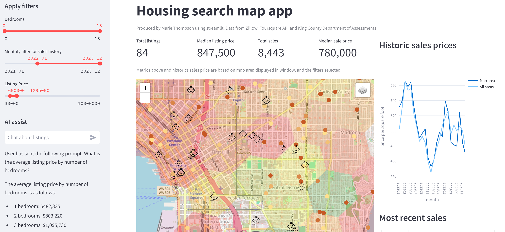

# Housing Map App
This project is an implementation of an interactive web map, utilising spatial data and AI to assist in housing search and housing market understanding.
Listings data is combined with historic sales data (for trends), and points of interest (in this example daycares: targeting those interested in accessiblity to childcare).

URL when running: https://turbo-cod-r4w75j5jjrqhx64p-8501.app.github.dev/ 

Streamlit is used to build the app. The project is hosted with Codespaces. Code is all written in Python. OpenAI's GPT-3.5-turbo-0125 model is used for the chat function.

## Aims
The primary aim is to provide develop python programming skills, utilising cloud platforms and spatial tools to develop novel ways to present housing market analysis, for the individual user.
* Look in to spatial representations: I want to try out h3index as a hierarchical grid spatial representation rather than coordinate representation, and how this assists with implementing machine learning.
* Combine data on property listings, points of interest and transportation to assist with location choice.
* Explore retrieval augmented generation with foundation models to answer user queries on presented data.
  
## Next Steps
* Call listings and POI APIs directly in app (currently the data app uses static data stored as csvs, and listings are out of date).
* Add neigbourhood identifiers to record level data or use a different model (gpt-3.5 cannot calculate distances between places).
* Provide more complex temporal and spatial analysis utilising historical sales data.
* Improve visualisation of relative prices in map.
* Build functionality of AI chat.
* Allow AI chat response to interact with map.
* Improve overall presentation and formatting of app.

## Data
Sales data: kingco_sales.csv\
https://www.kaggle.com/datasets/andykrause/kingcountysales/data \
Andy Krause\
Data produced from King County Assessors Office data.

Listing data: Zillow data, from RapidAPI sources\
https://rapidapi.com/apimaker/api/zillow-com1 \
https://rapidapi.com/s.mahmoud97/api/zillow56

Point of interest data:
Foursquare API

Icon: from Noun Project\
Firza Alamsyah

### To be used in further analysis:
Income by Census Tract, 2000, 2006-2022 (American Community Survey 5 year period) American Community Survey.
(Income data used to be combined with changes in house prices - not to compare incomes of residents by neighbournhood).
Steven Manson, Jonathan Schroeder, David Van Riper, Katherine Knowles, Tracy Kugler, Finn Roberts, and Steven Ruggles. IPUMS National Historical Geographic Information System: Version 18.0 [dataset]. Minneapolis, MN: IPUMS. 2023. http://doi.org/10.18128/D050.V18.0
https://www.nhgis.org/

King County Transit lines
King County Transit stops points
https://gis-kingcounty.opendata.arcgis.com/

30-Year Fixed Rate Mortgage Average in the United States
https://fred.stlouisfed.org/series/MORTGAGE30US
